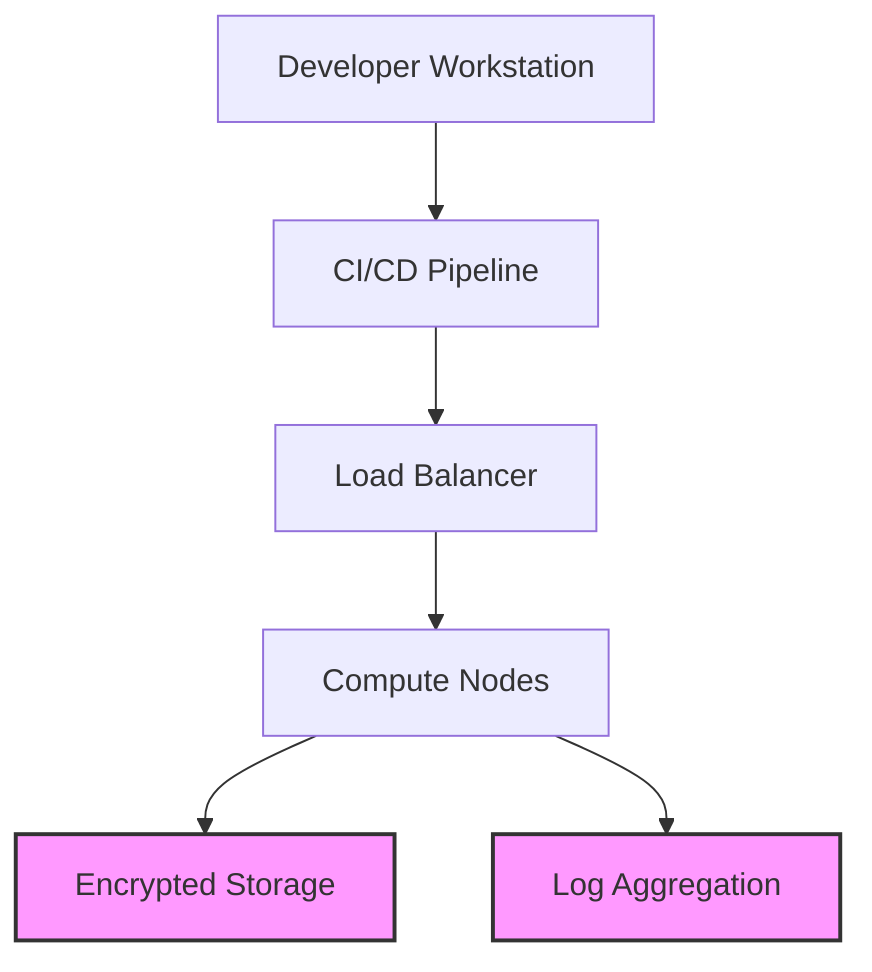

### 📁 `addendum-course deliver aids.md`

**Title:** Course Delivery Aids for PCI-Aware System Design
**Purpose:** Support instruction and student engagement by providing templates, exercises, and visualization tools aligned with PCI DSS v4.0.1.

---

## 🎓 Delivery Aid Files

| Filename                     | File Type | Description                                                         | PCI DSS Alignment              |
| ---------------------------- | --------- | ------------------------------------------------------------------- | ------------------------------ |
| `lesson-plan-outline.md`     | Markdown  | Week-by-week curriculum outline with embedded compliance hooks      | All 12 requirements referenced |
| `quiz-module-ci-storage.txt` | Text      | Student quiz covering CI/CD, data storage, and encryption practices | Req **3.4.1**, **6.4.3**       |
| `system-flow-diagram-v1.mmd` | Mermaid   | Editable system architecture flow diagram in Mermaid syntax         | Req **1.2.4**, **6.4.1**       |

---

### 📑 `lesson-plan-outline.md`

```markdown
# PCI-Aware System Design – Weekly Lesson Plan

## Week 1: Foundations of System Design
- Topics: Scalability, latency, tradeoffs
- PCI Tie-in: Requirement 1 – Secure Network Architecture

## Week 2: CI/CD and Change Control
- Topics: Jenkins, GitHub Actions, secure deployment
- PCI Tie-in: Req **6.4.1–6.4.3**

## Week 3: Secure Data Storage
- Topics: Encryption at rest, tokenization
- PCI Tie-in: Req **3.4.1**, **3.5.1**

## Week 4: Logging & Monitoring
- Topics: Fluentd, log retention, alerts
- PCI Tie-in: Req **10.2–10.7**, **12.10.5**

## Week 5: Access Control & Incident Response
- Topics: IAM, RBAC, MFA, playbooks
- PCI Tie-in: Req **7.2.2**, **8.3.1**, **12.10.5**

## Week 6: Capstone Project
- Design a compliant system using course artifacts
```

---

### 📑 `quiz-module-ci-storage.txt`

```text
1. What PCI DSS requirement covers secure storage of PAN?
   A) 3.4.1
   B) 6.4.3
   C) 10.2.1
   D) 12.10.5

2. Which of the following is a good practice in a CI/CD pipeline?
   A) Skipping secrets scanning to improve speed
   B) Hardcoding database credentials
   C) Performing static analysis before build
   D) Disabling change control logs

3. Fill in the blank: ______________ helps identify unauthorized modifications to artifacts during CI/CD deployment.

4. True or False: Change control documentation is only required when a rollback fails.
```

---

### 📑 `system-flow-diagram-v1.mmd`



---

> 📌 These resources may be extended with visual deliverables or packaged as a zip for training environments. Request diagram renderings or student workbooks as needed.
