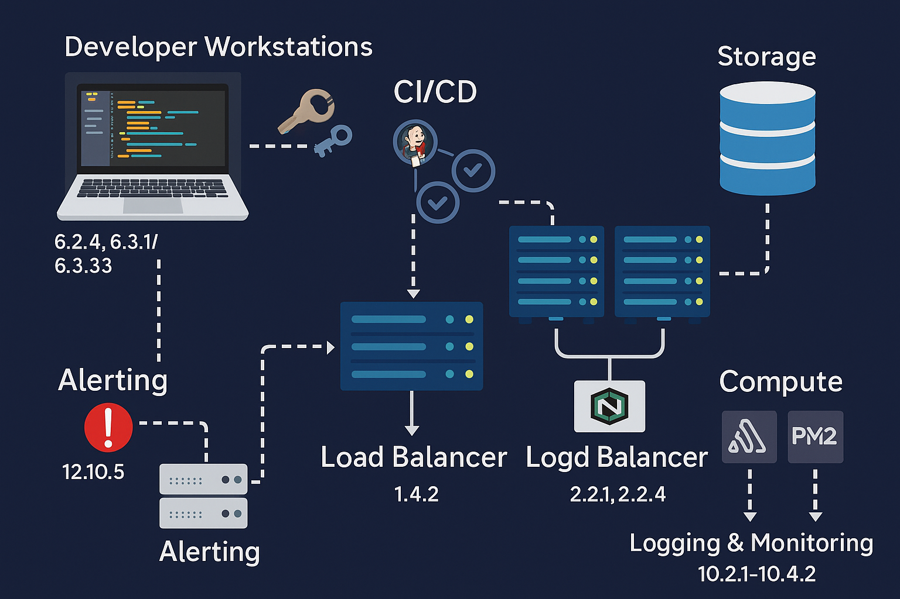

### 📁 `addendum-system design artifacts.md`

**Title:** System Design Artifacts for PCI-Aware Training
**Purpose:** Reference guide for foundational addendum files used to teach secure, scalable architectures with embedded PCI DSS v4.0.1 compliance hooks.

---

## 🔧 Foundational System Design Files

| Filename                             | File Type | Description                                                                                                                            | PCI DSS Hooks                                                                                                                                      |
| ------------------------------------ | --------- | -------------------------------------------------------------------------------------------------------------------------------------- | -------------------------------------------------------------------------------------------------------------------------------------------------- |
| `pci-aware-architecture-v1.png`      | Diagram   | High-level system architecture overview including CI/CD, load balancer, compute, storage, and logging layers.                          | Visual support across all Requirements; highlights network segmentation (Req 1.2.4), encryption (3.4.1), logging (10.2), and access control (7.x). |
| `secure-cicd-template-v1.yaml`       | YAML      | Secure CI/CD pipeline template with steps for code scan (SAST/DAST), artifact integrity, and deployment gating.                        | **6.4.1**, **6.4.3** (change control & code review); supports Req **6.3.2** for impact review.                                                     |
| `logging-map-pci10.json`             | JSON      | Log field-to-requirement mapping. Shows how Fluentd, ELK, or Splunk fields align with PCI Req 10 audit trail mandates.                 | **10.2.1**, **10.2.2**, **10.3.3**, **10.4.1.1** (log security, timestamps, audit records).                                                        |
| `developer-workstation-hardening.md` | Markdown  | Checklist and setup guide for developers. Covers static analysis, secrets detection, secure IDE configs, and remote desktop hardening. | **6.2.4**, **6.3.1**, **6.3.3** (developer security practices and tools).                                                                          |

---

## 🧩 Usage

These artifacts form the **core system design toolkit** for instruction, lab exercises, and compliance simulations. They should be:

* Included in every training package or exported zip
* Referenced by filename within course scripts and quizzes
* Cross-linked to evidence mappings when presenting PCI DSS test procedures

For visual flow diagrams and editable charts, use paired `.mmd` files or request SVG/PNG renderings from source Mermaid diagrams.

---

### `secure-cicd-template-v1.yaml`

```yaml
name: Secure CI/CD Pipeline

on:
  push:
    branches: [ main ]

jobs:
  build:
    runs-on: ubuntu-latest
    steps:
    - name: Checkout repository
      uses: actions/checkout@v3

    - name: Run Static Analysis (SAST)
      uses: github/codeql-action/init@v2
      with:
        languages: javascript

    - name: Run Secrets Scan
      uses: trufflesecurity/trufflehog@v3

    - name: Build Application
      run: npm install && npm run build

    - name: Deploy to Staging
      if: github.ref == 'refs/heads/main'
      run: ./scripts/deploy-staging.sh

    - name: Notify Security Team
      run: curl -X POST -H 'Content-type: application/json' --data '{"text":"New deployment to staging with security checks passed."}' $SLACK_WEBHOOK
```

---

### `logging-map-pci10.json`

```json
{
  "log_fields": {
    "timestamp": "10.4.1.1",
    "user_id": "10.2.1",
    "event_type": "10.2.2",
    "source_ip": "10.2.4",
    "resource_accessed": "10.2.5",
    "outcome": "10.2.6",
    "log_integrity": "10.5.1",
    "time_sync": "10.6.1"
  }
}
```

---

### `developer-workstation-hardening.md`

```markdown
# Developer Workstation Hardening Guide

## Overview
Secure setup and operation of developer workstations is essential to PCI DSS compliance and organizational security.

## Hardening Checklist

- ✅ Use encrypted disk volumes (FileVault/BitLocker)
- ✅ Install antivirus and configure auto-updates
- ✅ Run a local firewall (Little Snitch/UFW)
- ✅ Configure static code analysis in the IDE
- ✅ Block USB ports unless explicitly authorized
- ✅ Restrict terminal access to authorized shells
- ✅ Use password managers for credential storage
- ✅ Rotate SSH keys every 90 days
- ✅ Enable full-disk logging of local code scans

## PCI DSS Relevance
- **6.2.4** – Enforce secure coding practices
- **6.3.1** – Use of code review tools
- **6.3.3** – Detect and manage sensitive data
```

---



---
